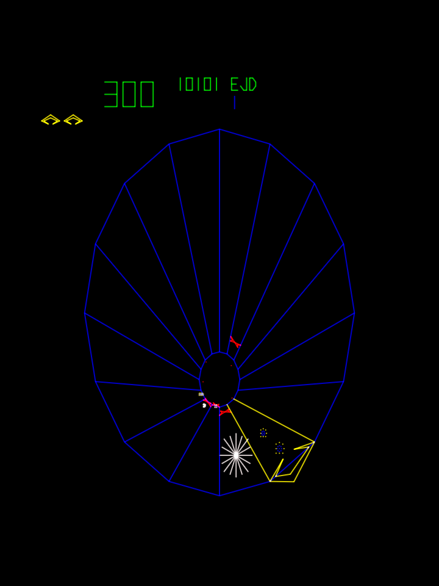
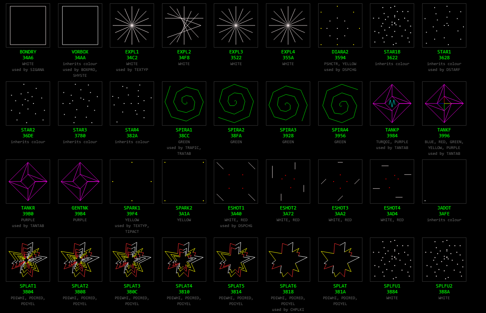

# Tempest — disassembly and C port

An **AI-assisted disassembly of Tempest** (Atari, 1981) and a complete,
playable **1:1 C port** of it — no emulation, no 6502 core at runtime; the
original program itself, translated one routine at a time. The reverse
engineering and the port were done together with an AI assistant
(Anthropic's Claude), with one rule enforced throughout: **no invented
data**. Every constant, table and branch traces to a ROM address, every name
is Atari's own identifier, and every behavioural question was settled by
running the ROM, not by guessing.


## The game, and every vector object in it

<p align="center">
  
  &nbsp;
  <a href="https://tcottrill.github.io/Tempest-Full-Disassembly-and-C-Port/disasm/shapes_preview.html">
    
  </a>
  <br>
  <sub>Left: the C port, <code>tempest_win.exe</code>. Right: part of
  <a href="disasm/shapes_preview.html"><code>disasm/shapes_preview.html</code></a> —
  click it for the <a href="https://tcottrill.github.io/Tempest-Full-Disassembly-and-C-Port/disasm/shapes_preview.html">live, animated page</a>.</sub>
</p>

[`disasm/shapes_preview.html`](disasm/shapes_preview.html) is one
self-contained page, generated from the ROM by `disasm/emit_shapes.py`: the
127 labelled vector-ROM pictures under Atari's names, the 14 pictures the
program draws between two lane points, the 41-character set, all 30 messages
in the four languages — and the 11 **CAM enemy-motion scripts**, the byte code
that decides how a flipper climbs the well, which the page **runs live**: pick
a script and watch the flipper move and flip lane to lane while the opcodes
trace beside it.

## What's in the repository

| where | what |
|-------|------|
| [`disasm/`](disasm/README.md) | the disassembly: the program ROM and the colour AVG vector ROM as plain assembler source that re-encodes to the ROM byte for byte, a defines file carrying the memory map, the hardware registers and Atari's RAM variables, the shape preview above, and the Python tools that generate and verify all of it from a ROM set — among them `macasm.py`, an assembler for Atari's own source dialect |
| [`c_src/`](c_src/README.md) | the C port: the whole 6502 program as C11, one file per Atari module; real AVG words built in a modelled 4K vector RAM; the Mathbox running its real bit-slice microcode; two real POKEYs and a real ER2055 EAROM behind the hardware seam; a Windows host (OpenGL beam renderer, XAudio2 sound, mouse / keyboard / joystick spinner, persistent high scores, the cabinet's own self test); the oracle, the call-by-call verifier and their scenario scripts; and a prebuilt **`tempest_win.exe`** with its **`tempest_win.ini`**. Builds with Visual Studio 2022, no external SDK |
| [`c_src/FINDINGS.md`](c_src/FINDINGS.md) | what the port proved and what it found: the six copy-protection checks, the wrong comments, the 61.5 Hz picture over a 27 Hz game loop, the verification techniques |
| [`disasm/_survey/tempest_inputs.md`](disasm/_survey/tempest_inputs.md) | the survey the work started from: ROM sets, memory map, Atari's source dialect |

Comments in `c_src` cite `PLAN.md`, `NOTES_m8.md` and `NOTES_m9.md`: the
working notes kept during the port (not [`disasm/PLAN.md`](disasm/PLAN.md)),
which are not part of this repository.
What they established is in the two READMEs and in `FINDINGS.md`.

## Sources, and what is not included

This is not blind reverse engineering, and two earlier works made it
possible. Neither is distributed here; both are cited wherever they are used.

- **Atari's own source code for Tempest** — the MACRO-65 sources (`ALWELG`,
  `ALDIS2`, `ALEXEC`, `ALSCO2`, … `.MAC`), the vector-generator macros, the
  Mathbox microcode and the RT-11 link image — published at
  [historicalsource/tempest](https://github.com/historicalsource/tempest).
  Tempest is by Dave Theurer; the archive also carries Ed Logg's vector
  macros (VGMC) and character set (ANVGAN), Rich Moore's ASCVG, Downend and
  Albaugh's coin routine (COIN65) and Mike Albaugh's Mathbox microcode.
  **Every routine name, variable name and upper-case comment in the listings
  is Atari's**, placed on the ROM by re-assembling that source.
- **The original disassembly: *Tempest Source Code*, the commented rev-3
  dump** — documentation copyright 1999 Arcade Gameshop Corporation, released
  under the OpenContent License; last updated 09/17/2004 by Josh McCormick
  (project lead and main documentarian), with Clay Cowgill (EAROM programming
  example, vector ROM image list, MAME tips) and Ken Lui (data segments, the
  assembler/disassembler package). It documented this ROM years before
  Atari's source surfaced. Its remarks are quoted in the listing at the
  addresses they were made, each marked **`[CS]`**, and two routine
  descriptions come from it. `c_src/FINDINGS.md` notes the few places where
  running the ROM showed a comment to be wrong.

The recovered listings are checked in, so nothing here needs either one to
build. The tools that read them expect Atari's archive unzipped at
`tempest-main/` beside `disasm/`, and the commented dump at
`disasm/Tempest Commented Source.txt`.

Hardware facts were cross-checked against the Tempest driver of the
[AAE emulator](https://github.com/tcottrill/AAE) and MAME's `tempest.cpp`.

## No ROMs included — bring your own

Atari's ROM images are not distributed here. The C port **builds, runs and
is verified call by call without them** — the ROM data the translated
program reads is checked in as generated C files and compiled into
`tempest_win.exe` and into the oracle — but the disassembly tools and the C
data generators read real ROM images, and so do the three gates (V, S, E)
that lean on the disassembly's build output.

Given a MAME `tempest` ROM set, one script builds the 64K working image and
regenerates and verifies every listing:

```bash
python disasm/gen_from_roms.py <path-to-tempest.zip-or-rom-dir> --check
```

The rev-3 chips are found by part number and CRC32, not by file name, so the
4K-chip set (`tempest.zip`), the 2K-chip set (`tempest3.zip`) or a directory
of loose files all work. `--check` adds the independent assembler round trip:
the listing is translated to ca65 syntax, assembled, linked and compared with
the ROM ([cc65](https://cc65.github.io), `--cc65 DIR`). Regenerating
reproduces the checked-in files byte for byte.

## Quick start

```bat
cd c_src
build_win.bat
tempest_win.exe
```

Or run the prebuilt `c_src\tempest_win.exe` on 64-bit Windows 10 or 11 (it
needs the Microsoft Visual C++ 2015-2022 x64 runtime, which most machines
already have). Keep `tempest_win.ini` beside it; the host writes
`tempest_win.log` there and keeps the high scores and bookkeeping in
`tempest.nv`, the EAROM's contents.

| control | keys |
|---|---|
| spinner | mouse; Left / Right; joystick X |
| fire | Left Ctrl, Space, left mouse button |
| superzapper | Left Alt, right mouse button |
| coin — left / centre / right mech | 5 / 6 / 7 |
| start 1 / 2 | 1 / 2 |
| self-test switch | F2 (a latched toggle, like the board's) |
| diagnostic step / slam | F1 / F3 |
| spinner tuning | `[` `]` mouse, Shift+`[` `]` keys |
| mouse capture / fullscreen / quit | F8 / Alt+Enter / Esc |

Every setting — option switches, pacing, the beam renderer, input, sound —
is described in [`c_src/README.md`](c_src/README.md#tempest_winini), along
with the command line and the headless tools.

## The listing is Atari's source, re-assembled

`disasm/macasm.py` is an assembler for the MACRO-65 dialect Atari's sources
are written in — macros, the HLL65 structured-programming layer, the vector
macros, left-to-right expressions, six-significant-character symbols. It
assembles the twelve modules of the rev-3 build at the link bases of Atari's
map and compares the result with the ROM; the listing generator then walks
the ROM with the source statement for every address in hand.

| | |
|---|---|
| program ROM bytes emitted by the source, all matching | **20,478 / 20,480** (the other two, `$DFF8-$DFF9`, are ROM fill no statement assembles) |
| vector ROM bytes emitted by the source, all matching | **4,096 / 4,096** |
| source modules assembled at their link bases | **12 of 12** |
| symbols recovered | **1,804** |
| routine headers, each with a description | **299** — 271 from Atari's source, 2 from the commented dump, 26 written here and marked `[note]` |
| program listing re-encoded and compared with the ROM | **20,480 bytes, 0 mismatches** |
| vector listing re-encoded and compared with the ROM | **4,096 bytes, 0 mismatches** |
| independent ca65/ld65 assemble-and-link round trip | **20,480 bytes, 0 mismatches** |

The target is **rev 3** — MAME's parent set `tempest`.

## The C port is proven against the running ROM, call by call

`c_src/tests/refrun.c` is the oracle: the real rev-3 program on a 6502
interpreter with the board modelled around it — the 246 Hz IRQ, the AVG's HALT
line from actually walking the display list, POKEY's RANDOM as a per-cycle
poly counter, the Mathbox microcode, the EAROM, the watchdog.
`c_src/tests/lockstep.c` runs it and, at **every call of every translated
routine**, snapshots the machine at the ROM's `JSR`, lets the ROM run to its
`RTS`, then runs the C function from the same snapshot with the ROM's hardware
reads replayed, and compares all of RAM, vector RAM, colour RAM, the I/O
write sequence, the decimal flag and the documented return registers.
Interrupts that land inside translated code are placed at the exact C
statement, each with a proof that the placement commutes. `c_src/tests/gate.c`
then replays whole runs through the C modules alone, with no 6502 linked.

| | |
|---|---|
| routine calls compared, 12 scripted runs | **8,823,670 — 0 failed**, 0 tainted, 0 IRQ moved |
| whole MAINLN and self-test passes compared | **30,586 — 0 failed, 0 skipped** |
| RESET regions (power-on, watchdog, `JMP RESET`, scripted) | **18, all passed** |
| IRQs placed inside passes, each with a commutation proof | **175,062** |
| whole-run trace replays, C modules alone | **12 of 12, every pass byte-identical** |
| Gate V — `avg.c` draws every vector-ROM shape as the reference | **168 / 168** |
| Gate S — the self test; Gate E — the EAROM round trip | **69 / 69** and **29 / 29** checks |

The runs are attract mode, a coined game, high-score entry, two players, a
game played to wave 24 and 194,152 points, the superzapper, the slam switch,
the self test from power-on and from mid-game, and an EAROM write followed by
a power-cycled read-back. The dumps and traces are recorded from the running
ROM, so they are not distributed; `c_src\record_refs.bat` records them again,
identically, and [`c_src/README.md`](c_src/README.md#verification) says how
to run every gate. Deliberate mutations of the C were each caught at the
exact byte before being reverted.

## Hardware, briefly

- **CPU:** 6502 at 1.512 MHz, one periodic IRQ at 246.09 Hz — 12.096 MHz /
  4096 / 12, exactly 6,144 CPU cycles.
- **Display:** Atari's colour **Analog Vector Generator**. The CPU builds
  display lists in 4K of vector RAM at `$2000`, which call into 4K of vector
  ROM at `$3000`; sixteen colour-RAM entries at `$0800` give the palette its
  per-wave colours.
- **Mathbox:** four Am2901 bit-slices running Atari's microcode from seven
  PROMs, at `$6060-$609F`. It does the perspective multiply and divide for
  every point of the well; the port executes the real microcode.
- **Sound, spinner and buttons:** two POKEYs at `$60C0` and `$60D0`. The
  spinner, the fire, zap and start buttons and the difficulty and cabinet
  switches are all read through the POKEYs' pot lines, and `RANDOM` doubles
  as part of the copy protection.
- **Persistence:** a GI ER2055 EAROM for the top three scores, their initials
  and the bookkeeping.
- **Program:** 20K of 6502 code at `$9000-$DFFF`; the top of it is mirrored at
  `$E000-$FFFF`, which is where the 6502 finds its vectors.

### The picture runs at 61.5 Hz, the game logic at 27

Two clocks, and they are not the same one. The **picture** belongs to the
vector generator: four 246.09 Hz IRQs per picture, **61.5 Hz**, and never
faster — but a crowded display list costs the AVG more than those 16.25 ms to
draw, and then the picture takes what the list costs: 57 to 60 Hz in waves 2
and 3, around 50 Hz while the player drops down the well, 46 Hz in the attract
demo. The **game logic** is slower and separate: the mainline waits until the
IRQ has counted nine ticks (`CMP #$09` at `$C7A9`) before it runs a pass,
246.09 / 9 = 27.3 passes per second at most (9.214 IRQs per attract pass on
the oracle), so each list is drawn about twice before the next pass changes
it.

The port models both. It keeps one cycle timeline at 1.512 MHz, services the
IRQ on the 6,144-cycle grid and charges each pass the CPU time the 6502 would
have spent, from a cost model fitted on 19,994 oracle passes (9.21 IRQs per
pass, machine time against wall time 1.0000). The picture is an event on the
same timeline, and its length is **counted, not approximated**: as `avg.c`
walks the list it adds up the AVG's own cycles — the state PROM's ticks for
every instruction plus the timer of every vector and every centring, at the
12.096 MHz master clock — and cycles / 12.096 MHz is the picture's time, four
IRQs at the least. `tools\avg_prom_sim.py` checks that count against MAME's
AVG state machine run on the real state PROM: 582 recorded lists, identical to
the cycle. Measured on the Windows build over a minute of attract and play:
246.09 IRQ/s, 26.8 passes/s, 54 pictures a second; wave 1 draws in 15.9 ms
(61.5 Hz), wave 2 in 17.1 ms (58.5 Hz), wave 3 in 16.8 ms (59.6 Hz).

Tempest's master lists end in `JMPL VECRAM` and the IRQ only restarts a halted
AVG, so nothing in the program holds a short list back; `vg_window=free` in
`tempest_win.ini` drops the four-IRQ floor and shows that, up to 130 pictures
a second on a near-empty screen. `tests\avgtime.exe` prints the draw time and
both rates for any recorded list, and `tempest_win.log` ends every session
with the draw time of each game state and wave.

### Six copy-protection checks, and why Tempest crashes under emulation

Rev 3 carries six tamper checks: sums over the copyright literal and over
ROM, a check of the copyright message as it sits in vector RAM, and two that
test that POKEY's `RANDOM` behaves like the real chip, cycle for cycle. A
failed check does nothing at the time. It sets a cell that, many waves or
150,000 points later, quietly corrupts the game — a stray `SED`, an `INC` run
through zero page, a write into the stack, a watchdog reset.

These checks are well known for crashing the game under emulation, the
`RANDOM` checks and the copyright checks above all: the game plays normally
and then glitches or resets from around 150,000 points, because a POKEY that
is not exact to the cycle, or a copyright message that is altered or not
built as the board builds it, tripped a check long before. The `RANDOM` tests
leave no margin. Two reads of `RANDOM` taken 4 cycles apart must overlap by a
nibble, and the first read after `SKCTL = 0` must still see the held `$FF`.

So the port had to be exact here, and it measures that it is. With the real
POKEY poly counters clocked on one cycle timeline all six cells stay zero:
the long scripted game reaches wave 24 and 194,152 points on the oracle with
every one of them clear on every pass, and the native build's self test
watches them on every pass as well. Its POKEY probe also shows the failure
emulators hit: charge a `RANDOM` read 5 cycles instead of 4 and the nibble
check trips in 5,908 of 6,000 start phases.
[`c_src/FINDINGS.md`](c_src/FINDINGS.md) has the table, the addresses, and
the comments the ROM proved wrong.

## Provenance and method

Re-assemble Atari's source and hold it against the ROM, so that every name
and comment is placed by the bytes, not by eye. Generate the listings from
that, and verify them twice, independently. Translate one routine at a time,
reproducing every store the ROM makes, against a memory model generated from
the same defines the listings assemble against. Verify every call of every
routine against the running ROM, then the whole program without it.

## License

The disassembly, the tools and the C port are released under the **GNU
General Public License, version 2 or later**, the same terms as MAME (see
[`LICENSE`](LICENSE)). Two files carry MAME's BSD-3-Clause terms for the
parts translated from MAME sources, and keep that attribution in their
headers: `c_src/c012294.c` (the POKEY's audio polynomial tables and its SKCTL
hold, from `pokey.cpp`) and `c_src/er2055.c` (from `er2055.cpp`). The rest of
the POKEY file is translated from the AAE emulator's engine-free POKEY core;
its pot scanner follows the Altirra Hardware Reference (Avery Lee), and its
RANDOM chain is a gate-level transcription of Atari's schematics (Nick
Mikstas's atari_pokey). The vendored framework files in
`c_src/platform/windows/` keep their own headers and their own terms. The
names and comments recovered from Atari's source archive remain Atari's, and
the `[CS]` remarks remain their authors', quoted under the OpenContent
License; neither source is distributed here. Tempest is a trademark of its
owner, and no ROM images are included.
